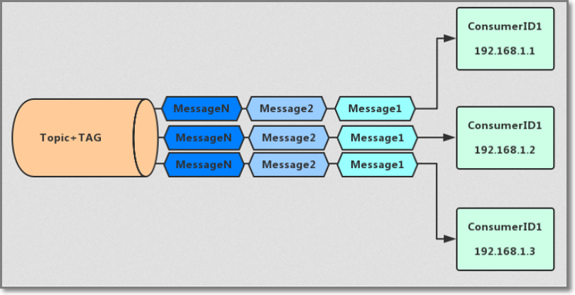
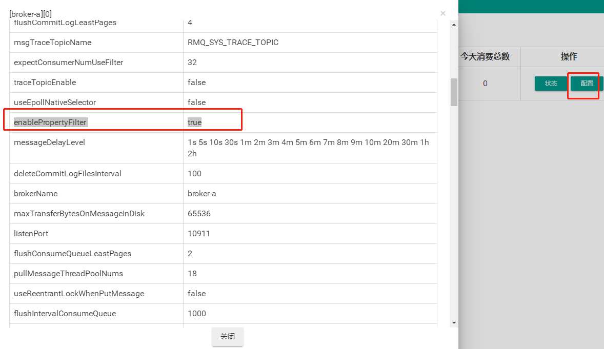

# RocketMQ 03

## 消息

### 消息消费模式

消息消费模式由消费者来决定，可以由消费者设置MessageModel来决定消息模式。


消息模式默认为集群消费模式

```
 consumer.setMessageModel(MessageModel.BROADCASTING);
 consumer.setMessageModel(MessageModel.CLUSTERING);
```

#### 集群消息


集群消息是指**集群化部署消费者**

当使用集群消费模式时，MQ 认为任意一条消息只需要被集群内的任意一个消费者处理即可。

**特点**

- 每条消息只需要被处理一次，broker只会把消息发送给消费集群中的一个消费者
- 在消息重投时，不能保证路由到同一台机器上
- 消费状态由broker维护

#### 广播消息



当使用广播消费模式时，MQ 会将每条消息推送给集群内所有注册过的客户端，保证消息至少被每台机器消费一次。

**特点**

- 消费进度由consumer维护

- 保证每个消费者消费一次消息

- 消费失败的消息不会重投

  

### 发送方式

#### 同步消息

消息发送中进入同步等待状态，可以保证消息投递一定到达

#### 异步消息

想要快速发送消息，又不想丢失的时候可以使用异步消息

```
         producer.send(message,new SendCallback() {
			
			public void onSuccess(SendResult sendResult) {
				// TODO Auto-generated method stub
				System.out.println("ok");
			}
			
			public void onException(Throwable e) {
				// TODO Auto-generated method stub
				e.printStackTrace();
				System.out.println("err");
			}
		});
```

#### 单向消息

只发送消息，不等待服务器响应，只发送请求不等待应答。此方式发送消息的过程耗时非常短，一般在微秒级别。

```
 producer.sendOneway(message);
```


### 批量消息发送

可以多条消息打包一起发送，减少网络传输次数提高效率。

`producer.send(Collection c) `方法可以接受一个集合 实现批量发送

```
 public SendResult send(
        Collection<Message> msgs) throws MQClientException, RemotingException, MQBrokerException, InterruptedException {
        return this.defaultMQProducerImpl.send(batch(msgs));
    }
```


- 批量消息要求必要具有同一topic、相同消息配置
- 不支持延时消息
- 建议一个批量消息最好不要超过1MB大小
- 如果不确定是否超过限制，可以手动计算大小分批发送

### TAG

可以使用tag来过滤消费

 在Producer中使用Tag：

```
Message msg = new Message("TopicTest","TagA" ,("Hello RocketMQ " ).getBytes(RemotingHelper.DEFAULT_CHARSET));
```

  在Consumer中订阅Tag：

```
consumer.subscribe("TopicTest", "TagA||TagB");// * 代表订阅Topic下的所有消息
```

### SQL表达式过滤

消费者将收到包含TAGA或TAGB或TAGB的消息. 但限制是一条消息只能有一个标签，而这对于复杂的情况可能无效。 在这种情况下，您可以使用SQL表达式筛选出消息.

#### 配置

在`broker.conf `中添加配置

```
enablePropertyFilter=true
```


启动broker 加载指定配置文件

```
../bin/mqbroker -n 192.168.150.113:9876 -c broker.conf 
```

随后在集群配置中可以看到



#### **实例**

```
        MessageSelector selector = MessageSelector.bySql("order > 5");
        consumer.subscribe("xxoo3", selector);
```

#### 语法

RocketMQ只定义了一些基本的语法来支持这个功能。 你也可以很容易地扩展它.

1. 数字比较, 像 `>`, `>=`, `<`, `<=`, `BETWEEN`, `=`;
2. 字符比较, 像 `=`, `<>`, `IN`;
3. `IS NULL` 或者 `IS NOT NULL`;
4. 逻辑运算`AND`, `OR`, `NOT`;

常量类型是:

1. 数字, 像123, 3.1415;
2. 字符串, 像‘abc’,必须使用单引号;
3. `NULL`, 特殊常数;
4. 布尔常量, `TRUE` 或`FALSE`;

### 延迟消息

RocketMQ使用**messageDelayLevel**可以设置延迟投递

**默认配置为**

```
messageDelayLevel	1s 5s 10s 30s 1m 2m 3m 4m 5m 6m 7m 8m 9m 10m 20m 30m 1h 2h
```

#### 配置

在`broker.conf `中添加配置

```
messageDelayLevel=1s 5s 10s 30s 1m 2m 3m 4m 5m 6m 7m 8m 9m 10m 20m 30m 1h 2h
```

这个配置项配置了从1级开始，各级延时的时间，可以修改这个指定级别的延时时间；

时间单位支持：s、m、h、d，分别表示秒、分、时、天；

#### 使用

发送消息时设置

```
message.setDelayTimeLevel(1); 
```

### 事务消息

分布式系统中的事务可以使用TCC（Try、Confirm、Cancel）、2pc来解决分布式系统中的消息原子性

RocketMQ 4.3+提供分布事务功能，通过 RocketMQ 事务消息能达到分布式事务的最终一致

#### RocketMQ实现方式

**Half Message：**预处理消息，当broker收到此类消息后，会存储到RMQ_SYS_TRANS_HALF_TOPIC的消息消费队列中

**检查事务状态：**Broker会开启一个定时任务，消费RMQ_SYS_TRANS_HALF_TOPIC队列中的消息，每次执行任务会向消息发送者确认事务执行状态（提交、回滚、未知），如果是未知，等待下一次回差。

**超时：**如果超过回查次数，默认回滚消息

#### TransactionListener的两个方法

##### executeLocalTransaction

半消息发送成功触发此方法来执行本地事务

##### checkLocalTransaction

broker将发送检查消息来检查事务状态，并将调用此方法来获取本地事务状态

##### 本地事务执行状态

**LocalTransactionState.COMMIT_MESSAGE**

执行事务成功，确认提交

**LocalTransactionState.ROLLBACK_MESSAGE**

回滚消息，broker端会删除半消息

**LocalTransactionState.UNKNOW**

暂时为未知状态，等待broker回查